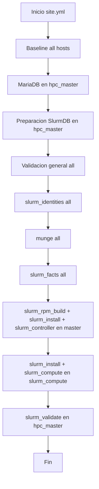

# Arquitectura y ejecucion

## Vision general

`site.yml` orquesta el cluster en capas:
1. Baseline de sistema y red.
2. Base de datos de accounting.
3. Validacion general.
4. Capa Slurm (identidades, auth, facts, instalacion, servicios).
5. Validacion Slurm y smoke tests.

## Diagrama de flujo (site.yml)

## Responsabilidades por capa

- Baseline (`common`, `users_ssh`, `firewall`, `network_internal`, `cluster_routing`, `nfs_hpc`, `nvidia_cuda`, `llm_env`): deja el SO listo para cluster y GPU.
- DB (`mariadb_server`, `slurm_db_prep`): habilita accounting de Slurm.
- Slurm core (`slurm_identities`, `munge`, `slurm_facts`, `slurm_install`, `slurm_controller`, `slurm_compute`): instala y activa scheduler.
- Validacion (`validate`, `slurm_validate`): comprueba salud y ejecucion real de jobs.

## Dependencias importantes

- `slurm_controller` depende de `slurm_install` y de `munge` operativo.
- `slurm_compute` depende de `slurm_install` y de `slurm.conf/gres.conf` ya desplegados.
- `slurm_validate` depende de particiones funcionales y comandos Slurm disponibles en master.
- `llm_env` depende de `nvidia_cuda` para validaciones CUDA consistentes en nodos con GPU.

## Decisiones tecnicas clave

- Configuracion declarativa por roles.
- Separacion de configuracion vs validacion.
- Preferencia por idempotencia (`state`, `creates`, `changed_when: false` en checks).
- Uso de facts (`slurm_facts`) para generar `slurm.conf`/`gres.conf` por nodo.

## Riesgos operativos a controlar

- Cambios de red (`network_internal`, `cluster_routing`) pueden cortar acceso si el inventario no coincide con interfaces reales.
- Cambios de driver NVIDIA pueden requerir reboot.
- Cambios de Slurm sin orden (controller/compute) pueden dejar nodos `DRAIN` o `INVALID_REG`.
